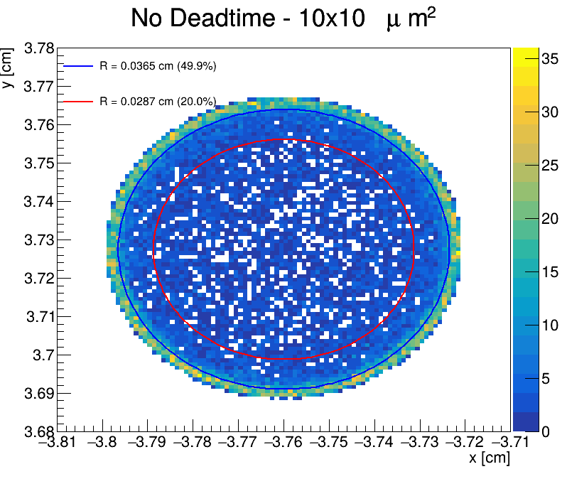

**In 5D calorimetry our goal is to incorporate time information, as captured through the LAr and Tile calorimeters, combined with track measurements for precise vertex t0 reconstruction as a novel feature within the ATLAS experiment framework.**

## dSiPM

Github Workspace: [HG-DREAM G4 simulation: dream 2.06](https://github.com/Liangyu5wu/DREAMSim)

### Photon Occupancy Study

<figure style="text-align: center;">
  
  <figcaption>Photon distribution display in the Cherenkov fiber</figcaption>
</figure>

## Recent Tasks

 
1. Convert #photons to energy

2. Plot (n>2) plots

3. Send the slides to Ariel


