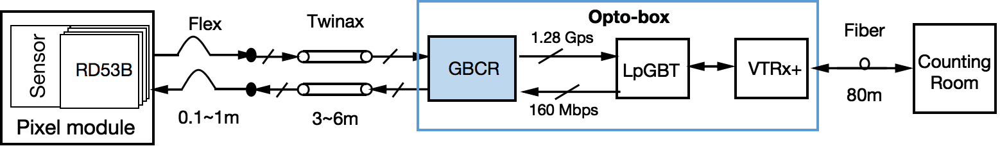

## Current Status

**The GigaBit Cable Receiver (GBCR) ASIC is designed as an equalizer chip to compensate the ITk pixel data transmission loss in the high frequency range.**

**There are ~4500 GBCR chips in the ITk Pixel system.**

<figure style="text-align: center;">
  
  <figcaption>ATLAS ITK readout system</figcaption>
</figure>

The TWiki page for GBCR: [GBCR](https://twiki.cern.ch/twiki/bin/viewauth/Atlas/GBCR)

My Github Link: [GBCR3_SLAC](https://github.com/Liangyu5wu/GBCR3_SLAC)

The GBCR Testing Github: [GBCR-Testing](https://github.com/OSU-HEP-HDL/GBCR-Testing)

## Performed QC Tests

1. EQ Amplitude Factors Test
2. Disable RX Channel Function Test
3. Retiming Mode Function Test
4. Retiming Mode & Voted Mode Correlation Test
5. RX 5 Channel Retiming Mode Test

## Recent Tasks

 
1. Test the influence from the cable lengths for the time window in retiming mode
2. Report the function of new firmware
3. Do several new power-cycling and check the good window region in retiming mode


