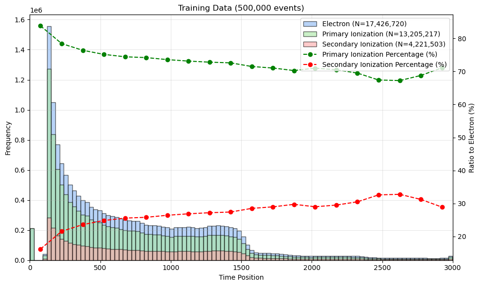

## Overall Goals

**To develop embedded FPGA technology that enables real-time AI/ML deployment on detector hardware for future ultra-high data rate experiments.**

## Edge-Deployed Algorithms

### Dual-readout Calorimeter

*Extract C&S components from waveform samples*

<figure style="text-align: center;">
  
  <figcaption>Prediction of the C&S components</figcaption>
</figure>

Github Link: [Models&Plotting](https://github.com/Liangyu5wu/On-chip_ML_DRO)

#### Milestones

 
1. Developed and evaluated algorithms for e- testbeam data


### Drift Chamber

*Predict ionization cluster numbers (dN/dx) for PID*

<figure style="text-align: center;">
  
  <figcaption>Distribution of Electrons in a DCH Cell</figcaption>
</figure>

#### Milestones

 
1. Developed and evaluated algorithms for a Garfield++ simulation dataset


## eFPGA Co-design

**Design eFPGA chips with SLAC Technology Innovation Directorate (TID).**
