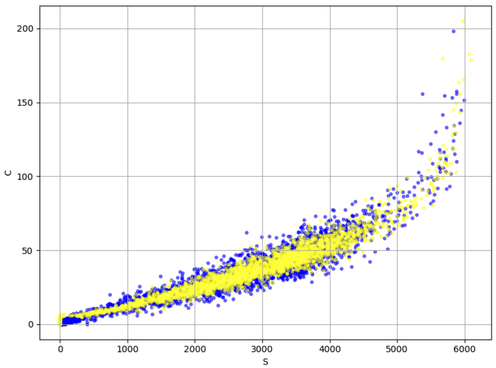

## Overall Goals

**Exploring the potential for ML-based front-end readout for waveform analysis and data compression in Future Colliders**

### Dual-readout Calorimeter

*Extract S&C components from raw waveforms*

<figure style="text-align: center;">
  
  <figcaption>Prediction of the C&S components</figcaption>
</figure>

#### Recent Tasks

 
1. Waiting for the hardonic data



Github Link: [Models&Plotting](https://github.com/Liangyu5wu/On-chip_ML_DRO)

### Drift Chamber

*Predict ionization cluster numbers for PID*

#### Recent Tasks

 
1. D2 algorithm implementation
2. Regressing the #clusters directly


