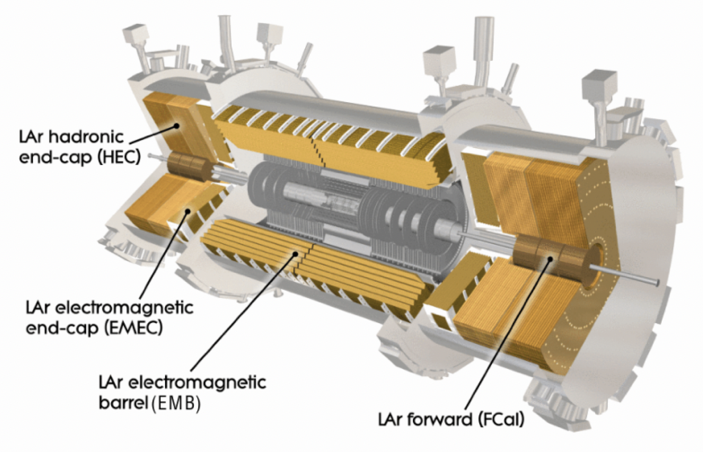

**How to better utilize the timing capabilities of Liquid Argon (LAr) Calorimeter in ATLAS?**

## Current Status

**Current ATLAS LAr Calorimeter has good timing resolution of O(100ps) or better at best cells. (HGTD can reach ~30ps)**

**Can we use LAr cells to achieve O(100ps) resolution for complex objects?**

Github Link: [Data processing](https://github.com/Liangyu5wu/Vertex0)

<figure style="text-align: center;">
  
  <figcaption>ATLAS LAr Calorimeter</figcaption>
</figure>

## Recent Tasks

 
1. ML implementation
2. US-ATLAS Workshop Slides
3. Further distinguishing the b-jets and light-quarks (and gluons).

