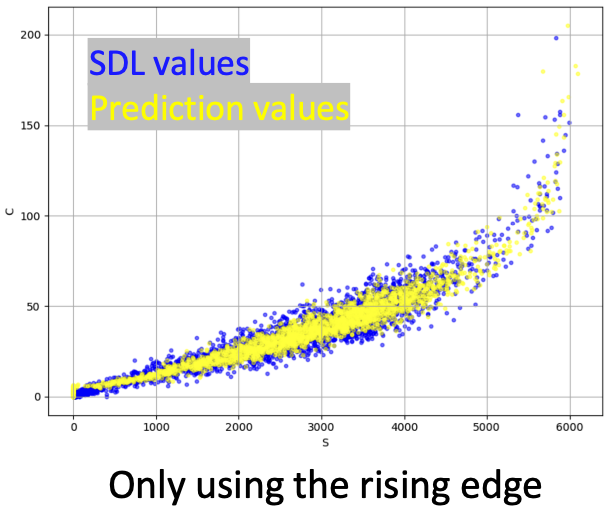

## The Goal

**Exploring the potential for ML-based front-end readout for waveform analysis and data compression
in dual readout calorimeters.**

<figure style="text-align: center;">
  
  <figcaption>Prediction of the C&S components</figcaption>
</figure>

## Tasks

 
1. Waiting for the hadronic data


